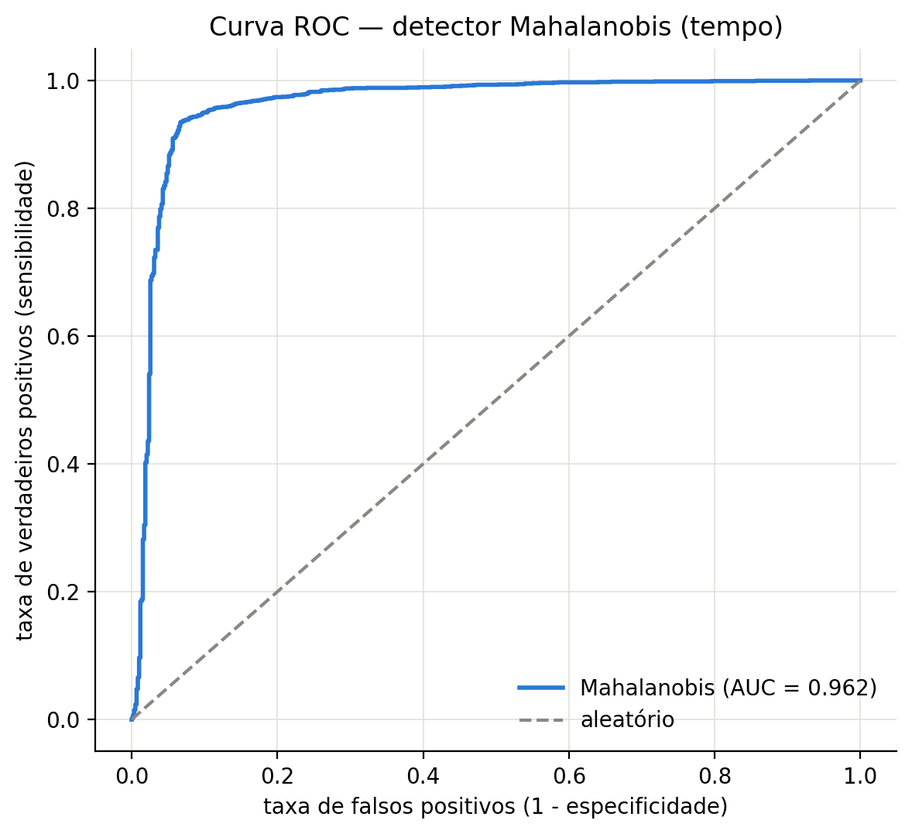
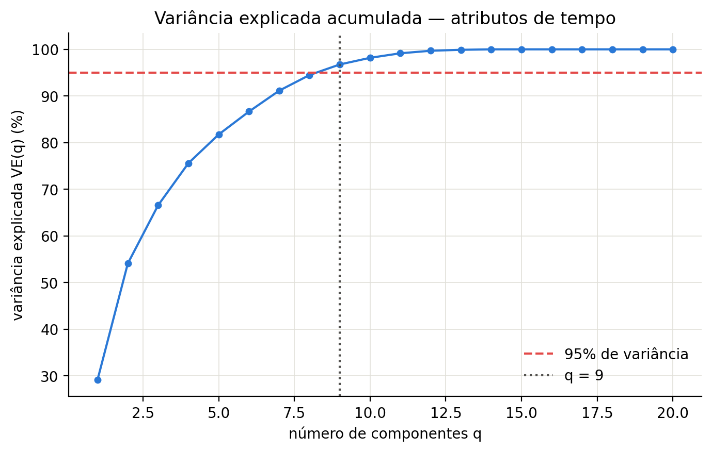

# Detecção de anomalias em ECG

Detector de batimentos cardíacos anômalos treinado **só com exemplos normais** —
modelagem de classe única sobre a base ECG5000, com extração de atributos,
três detectores e protocolo de 100 rodadas Monte Carlo.

**F1 = 0,944 · AUC = 0,962 · reproduz do zero em 13 segundos.**

Escrito inteiramente em NumPy/SciPy: nenhum estimador de scikit-learn é usado.
Mahalanobis, PCA e as métricas são implementados à mão.

<p align="center">
  
  
</p>

---

## O problema

Em detecção de anomalia raramente existe uma base rotulada de defeitos: você tem
muitos exemplos do que é normal e quase nada do que dá errado. O detector precisa
aprender a fronteira do normal e sinalizar tudo que cai fora — sem nunca ter visto
uma anomalia no treino.

É o cenário de **classe única**: treino com 80% dos batimentos normais, teste com os
20% restantes **mais todas as anomalias**. O limiar sai do percentil 95 do escore
observado no treino, sem olhar para os positivos.

## Como funciona

```
sinal (140 amostras)
     │
     ├── atributos de tempo      20 estatísticas: média, RMS, assimetria, curtose,
     │                           energia, cruzamentos por zero, IQR, parâmetros de Hjorth
     │
     └── atributos de frequência 15 descritores da PSD: centroide, espalhamento,
                                 entropia, planura, potência em 5 bandas
     │
     ▼
  z-score ajustado SÓ no treino  ──▶  detector  ──▶  escore  ──▶  limiar (percentil 95)
```

Três detectores, todos escritos do zero:

| Detector | Escore |
|---|---|
| **Euclidiano** | distância quadrática ao centroide do normal |
| **Mahalanobis** | distância ponderada pela inversa da covariância |
| **PCA** | erro de reconstrução no subespaço principal (autoencoder linear) |

## Resultados

100 rodadas Monte Carlo, média ± desvio-padrão. Atributos de tempo:

| Detector | Acurácia | Sensibilidade | Especificidade | Precisão | F1 | Tempo |
|---|---|---|---|---|---|---|
| Euclidiano | 0,719 | 0,654 | 0,950 | 0,979 | 0,784 | 0,36 ms |
| **Mahalanobis** | **0,908** | 0,897 | 0,949 | 0,984 | **0,939** | 3,75 ms |
| PCA | 0,598 | 0,500 | 0,949 | 0,972 | 0,660 | 2,71 ms |

Com redução PCA antes do detector (20 → 9 componentes, 96,8% da variância):

| Detector | Acurácia | F1 | Tempo |
|---|---|---|---|
| Euclidiano | 0,712 | 0,777 | 0,36 ms |
| **Mahalanobis** | **0,916** | **0,944** | **1,67 ms** |

## O que os números dizem

**A covariância é o que resolve o problema.** Mahalanobis chega a F1 0,939 contra
0,784 do euclidiano. Os atributos são fortemente correlacionados — a matriz é
4998 × 20 mas tem **posto 15**, ou seja, 5 atributos são combinação linear dos
outros. A distância euclidiana trata todas as direções como equivalentes e paga o
preço; a de Mahalanobis normaliza pela dispersão de cada direção.

**Reduzir dimensão melhorou tudo ao mesmo tempo.** Cortando de 20 para 9
componentes, o F1 subiu (0,939 → 0,944) e o tempo caiu 55% (3,75 → 1,67 ms). Não é
um trade-off: as 11 direções descartadas eram ruído e dependência linear, e removê-las
estabilizou a estimativa da covariância.

**A mesma técnica falha como detector e vence como pré-processamento.** PCA usado
para pontuar (erro de reconstrução) é o pior dos três, com F1 0,660. O mesmo PCA
usado para reduzir dimensão antes do Mahalanobis produz o melhor resultado geral.

**Os atributos de frequência não funcionam aqui** — F1 cai para 0,288 no melhor
caso, contra 0,939 no tempo. A anomalia no ECG5000 está na *forma* do batimento, e
o espectro de potência descarta justamente a informação de fase que carrega essa
forma. Resultado negativo, mas informativo: a escolha do domínio pesa mais do que a
escolha do detector.

## Detalhes de implementação

**Regularização de Tikhonov adaptativa.** Com posto 15 em 20 dimensões, a matriz de
covariância é singular e não pode ser invertida. O código mede o número de condição
por SVD e, se estiver ruim, soma `λI` com `λ` partindo de `1e-6 · tr(C)/p` e
multiplicando por 10 até a matriz ficar bem-condicionada — em vez de fixar um valor
arbitrário.

**Mahalanobis vetorizado.** As distâncias das 4998 amostras saem em uma chamada de
`np.einsum("ij,jk,ik->i", D, Cinv, D)`, sem laço e sem materializar a matriz
completa de produtos.

**Sem vazamento de dados.** Média e desvio do z-score, centroide, covariância e
subespaço PCA são todos estimados **apenas no conjunto de treino**, que contém
apenas negativos. O limiar também.

**Semente fixa e reprodutível.** `SEED = 42` no gerador; rodar duas vezes dá os
mesmos números.

## Como rodar

```bash
pip install -r requirements.txt
cd codigo && python executar.py
```

Roda o experimento inteiro — extração, posto, os três detectores em dois domínios,
100 rodadas cada, redução PCA e curva ROC — e regrava tudo em `resultados/`.
Leva cerca de 13 segundos.

## Estrutura

```
codigo/
  deteccao_anomalias.py   atributos, detectores, métricas e protocolo Monte Carlo
  executar.py             roda o experimento completo e salva tabelas e figuras
dados/ecg5000.csv         4998 batimentos × 140 amostras
resultados/figuras/       ROC, variância explicada, exemplos de batimento
resultados/tabelas/       métricas em CSV e resumo em JSON
relatorio/                relatório completo (LaTeX + PDF)
notebook.ipynb            versão em notebook, com a discussão passo a passo
```

## Base de dados

ECG5000, derivada do *UCR Time Series Classification Archive*: 4998 batimentos de
140 amostras, sendo 2919 normais e 2079 anômalos.

## Stack

Python · NumPy · SciPy · pandas · matplotlib

---

Origem: projeto final da disciplina de Reconhecimento de Padrões, Engenharia de
Computação — UFC. Reorganizado como repositório independente por
[Alisson Jaime](https://github.com/alissonjsb4).
